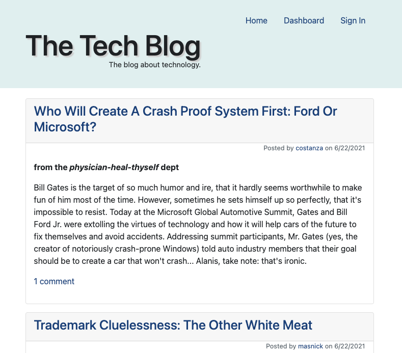
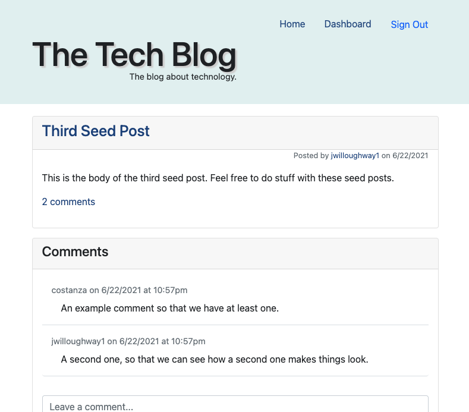
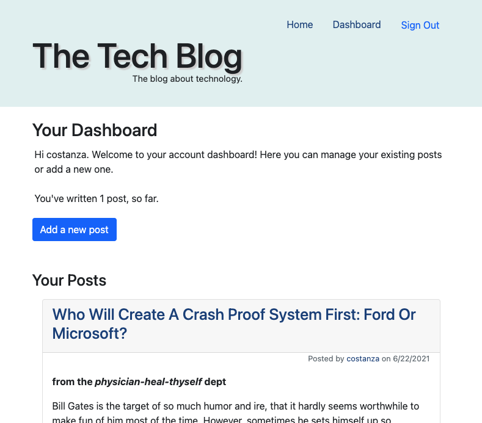
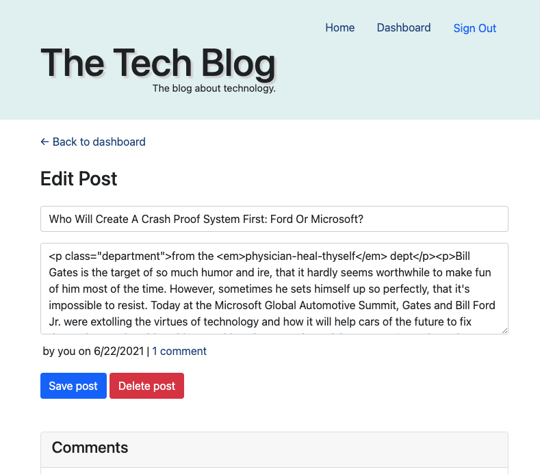

# Tech Blog

A CMS-style blog site designed with the developer/blogger in mind. Publish articles, blog posts, thoughts and opinions, and engage in discussions with your readers.

## Description

* When visiting the site for the first time, the visitor is presented with the homepage, which includes existing blog posts if any have been posted; navigation links for the homepage and the dashboard; and the option to sign in.
* Clicking the homepage option in the navigation takes the user to the homepage, which displays existing posts, each including the post title, post contents, and the number of comments, with the title and comment count linked to the single-post view.
* Clicking either of the other links in the navigation prompts the user to either sign up or sign in.
* The sign up form prompts the user to supply an email address and to create a username and password.
* Upon submitting the form, an account is created and the user is logged into the site.
* On subsequent visits to the site, the user can sign in by entering their username and password.
* When signed in the user sees navigation links for the homepage, the dashboard, and the option to log out.
* Clicking on an existing blog post's title or comment count brings the user to the single-post page, with the post title, contents, post creator’s username, and date created for that post, as well as the comments associated with the post and a form to leave a comment.
* When a commend is submitted (by a signed-in user), the post is updated to display the comment, the comment creator’s username, and the date it was submitted.
* The dashboard, reached via the "dashboard" link in the navigation presents the signed-in user with any blog posts they have already created and options to add a new blog post or edit an existing one.
* When adding a new blog post, the user is prompted to enter both a title and contents for the post.
* Clicking the "Save post" button stores the title and contents in the database and takes the user back to an updated dashboard with the new blog post.
* Clicking on the "Edit post" button for an existing post in the dashboard allows to delete or update the post, and returns the user to the updated dashboard.
* Clicking on the "Sign Out" option in the navigation ends the user's session and replaces the "Sign Out" option with "Sign In".
* If a user is idle on the page for more than a set time (set in `public/javascript/logout.js`), the user is automatically signed out of the site.

## Screenshots

 

## Installation
1) Make sure you're running a recent version of [Node.js](https://nodejs.org/en/) (app built on v14.16.1)
2) Clone the repository at https://github.com/costanza13/tech-blog
3) Run `npm install` in the project root directory
4) Make sure you have MySQL installed
5) Copy/rename the sample `.env.example` file to `.env` and replace the values with your MySQL connection details
6) Run the following to create the `tech_blog_db` database
  > `mysql -u <db_user> -p db/schema.sql`
7) For testing purposes, seed the database using the following command:
  > `npm run seed`

## Running the eCommerce Back End
- Run `npm start` from the project's root directory

## Technologies Used
* Node.js
* Express (web server)
* Sequelize (ORM)
* MySQL

## Credits

This app uses the following very helpful NPM packages:
- [Sequelize.js](https://www.npmjs.com/package/sequelize)
- [Node MySQL 2](https://www.npmjs.com/package/mysql2)
- [Express](https://www.npmjs.com/package/express)
- [bcrypt](https://www.npmjs.com/package/bcrypt)
- [handlebars](https://www.npmjs.com/package/handlebars)
- [dotenv](https://www.npmjs.com/package/dotenv)

## Links
* GitHub: [costanza13/tech-blog](https://github.com/costanza13/tech-blog)
* Deployed at: https://the-tech-blog-12hundred.herokuapp.com/
